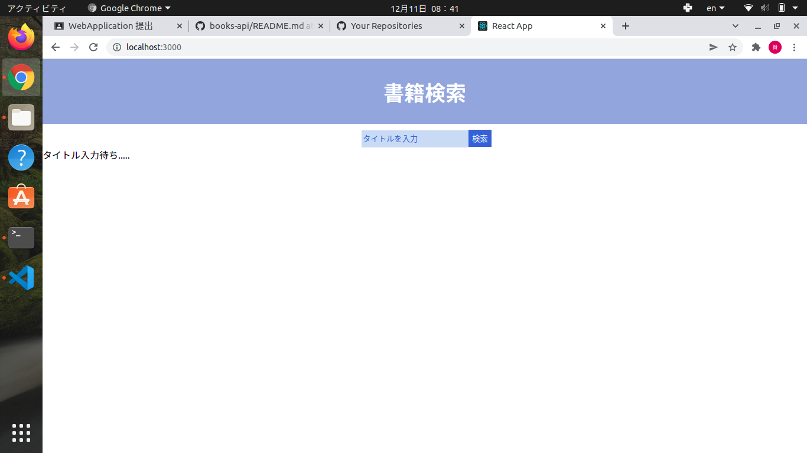
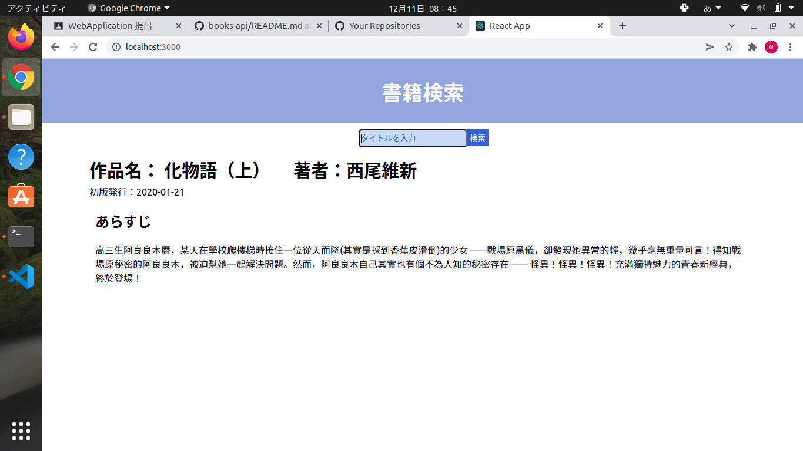

# WebApplication課題提出

## 課題１  Paizaのプログラミング学習のスクリーンショット

## 課題２  WebAPIを用いたReactApplicationのソースコード
* 作成したアプリ：書籍検索アプリ
* 使用したAPI：googlebooks

### ソースコード
* [メインコード(App.js)](./src/App.js)
* [本の検索コンポーネント(Searchbooks.js)](./src/Searchbooks.js)
* [hederコンポーネント(header.js)](./src/header.js)
* [CSSコード(App.css)](./src/App.css)

###  書籍検索アプリの使用方法

* 検索ボックスに本のタイトルを入力すると、検索した本の情報が表示されます。

ＥＮＤ
