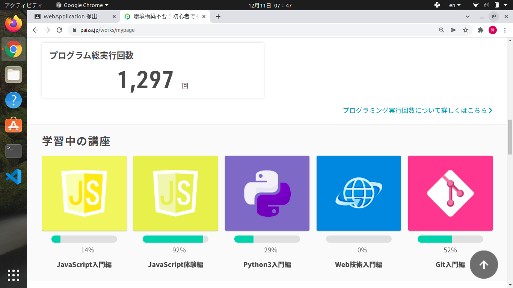

# WebApplication課題提出

## 課題１  Paizaのプログラミング学習のスクリーンショット
    　   
    

## 課題２  WebAPIを用いたReactApplicationのソースコード
* 作成したアプリ：書籍検索アプリ
* 使用したAPI：googlebooks

### ソースコード
* [メインコード(App.js)](./src/App.js)
